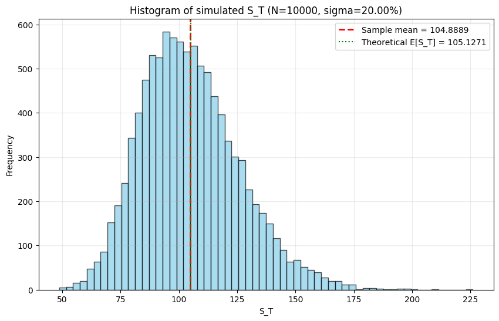
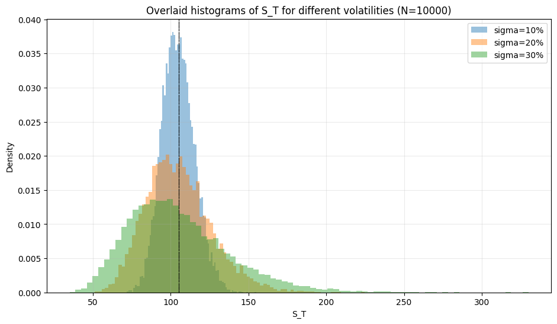

# Monte-Carlo-Simulation-Option-Pricing
## Mathematical Finance
### Faith Mwangi

This project estimates prices for European Call and Put options using Monte Carlo Simulation under the Geometric Brownian Motion (GBM) model. It also compares Monte Carlo results with the Black-Scholes analytical prices.

The workflow is simple: first, define the equations; then, run simulations to answer questions, plot the results, and interpret the outcomes. This makes it easy for anyone to reuse the functions for different parameters or volatilities.

---

## File Structure
- `monte_carlo.py` — simulation and plotting functions
- `histogram.png` — example single-sigma histogram
- `overlaid_histogram.png` — example overlay histogram across volatilities

---

## 1. Equations

### 1.1 Geometric Brownian Motion (GBM)

The future stock price $S_T$ is modeled as:
$$S_T = S_0 \cdot \exp\left(\left(r - \frac{1}{2}\sigma^2\right) T + \sigma \sqrt{T} Z \right)$$

Where:
$S_0$ = initial stock price
$r$ = risk-free rate (annual, continuous)
$\sigma$ = volatility
$T$ = time to maturity (years)
$Z \sim N(0,1)$ = standard normal random variable

### 1.2 European Call and Put Option Payoffs

- Call Payoff: $C_T = \max(S_T - K, 0)$
- Put Payoff: $P_T = \max(K - S_T, 0)$

Monte Carlo estimates discount the expected payoff:
$$C_0 = e^{-rT} \cdot \mathbb{E}[C_T], \quad P_0 = e^{-rT} \cdot \mathbb{E}[P_T]$$

Where $K$ is the strike price.

### 1.3 Black-Scholes Analytical Formulas

$$d_1 = \frac{\ln(S_0/K) + (r + 0.5 \sigma^2)T}{\sigma \sqrt{T}}$$

$$d_2 = d_1 - \sigma \sqrt{T}$$

$$C_0 = S_0 N(d_1) - K e^{-rT} N(d_2)$$

$$P_0 = K e^{-rT} N(-d_2) - S_0 N(-d_1)$$

Where $N(\cdot)$ is the standard normal cumulative distribution function.

---

## 2. How to Use

Run the simulation:

```python
from monte_carlo import monte_carlo_gbm, compare_volatilities

res = monte_carlo_gbm(S0=100, K=105, r=0.05, sigma=0.2, T=1, N=10000, seed=12345)
```

View the Monte Carlo results:

```python

print(res['mean_ST'], res['std_ST'])
print(res['call_price_MC'], res['put_price_MC'])
print(res['call_price_BS'], res['put_price_BS'])

```

## Simulation Output:

```

Sample mean of S_T: 104.888903
Sample std of S_T: 21.058641
Call price (MC): 7.907570
Put price (MC): 8.013248
Black-Scholes analytic comparison:
Call (BS): 8.021352
Put (BS): 7.900442

```

## Interpretation

The sample mean of $\mathbf{S_T}$ is 104.89, which is very close to the theoretical expected price $\mathbf{S_0 e^{rT} \approx 105.13}$. 
This confirms the simulation is accurate and unbiased.The standard deviation of 21.06 shows the spread of possible future stock prices.Monte Carlo call and put prices match closely with the Black-Scholes prices, validating the simulation methodology.

### Histogram Summary

Single Histogram ($\sigma=20\%$)


This is a histogram of 10,000 simulated stock prices after 1 year using GBM with sigma = 20% and T = 1 year.

The plot shows a lognormal right-skewed distribution. Most simulated prices cluster around 90–115, with a long right tail providing the potential upside for call options. The mean is clearly marked.

### Overlayed Histograms ($\sigma=10\%, 20\%, 30\%$)



The plot overlays the estimated density of stock prices after 1 year (N = 10,000) for three volatilities (10%, 20%, 30%). Each colored histogram shows the distribution of simulated prices for that sigma.

The overlaid plots show that higher volatility increases the spread of the stock price distribution, resulting in fatter tails. This increased chance of extreme outcomes (high or low) raises the value of both call and put options. The mean remains consistent across all volatilities, which is consistent with the risk-neutral expectation.


## Role of Z in the Simulation

Z ~ N(0,1) is the standardized random shock that injects uncertainty into the GBM formula. Each draw of Z represents one possible market scenario and determines how much the terminal stock price S_T deviates from its expected value.  

**Mathematical intuition:**  
GBM models log-returns as the sum of many tiny, independent random shocks over [0,T]. By the Central Limit Theorem, the aggregate of these shocks is Gaussian. Writing it as σ√T·Z, with Z ~ N(0,1), conveniently standardizes the stochastic part of the log-return. In the risk-neutral GBM formula:
$$S_T = S_0 \cdot \exp\big((r - 0.5\sigma^2)T + \sigma \sqrt{T} \, Z\big)$$
the term σ√T·Z represents the random component that drives the variation in outcomes.  

**Financial interpretation:**  
Z captures the unpredictable component of returns—news, trades, or shocks—aggregated over the period T. Under risk-neutral pricing, the drift is set to r, but the uncertainty still comes from Z. Option payoffs depend on how S_T moves relative to K, so Z directly affects option values.  

**Why it matters for Monte Carlo:**  
- Sampling many independent Z values generates many possible S_T outcomes.  
- Discounting the payoffs and averaging over simulations approximates the expected option price.  
- Because Z is normal, log(S_T) is normal and S_T is lognormal, which explains the right-skewed distributions in histograms and determines tail behavior crucial for option pricing.  

Contact
Faith Mwangi — FMuthoniMwangi
